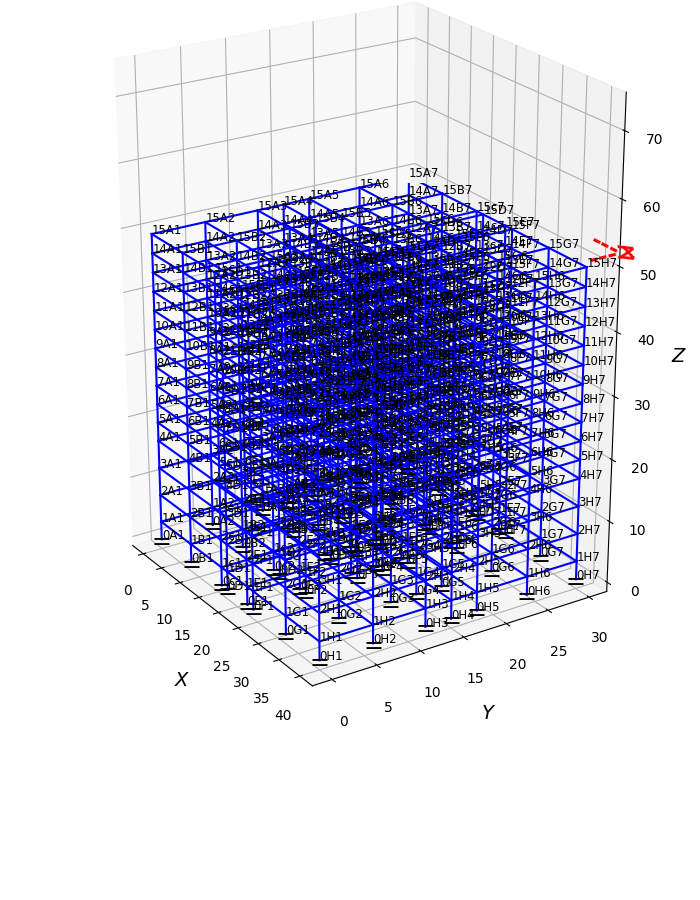

# femstructure

Impletementation of finite element method to solve structural analysis, including 3d frames and trusses. More later.

## Installation

To use `virtualenv` to manage dependencies, first setup a virtualenv environment:

    python3 -m venv venv
    source venv/bin/activate

Then within your environment install the requirements:

    pip install .

If you'd like to be able to edit the code that has been installed without
having to re-install it, run

    pip install -e .

## To run command line

eg.

to create a project 'two_story_frame' in the directory \_meta/two_story_frame/...

    create -c src/femstructure/create_stories/config/config_two_story_frame,json

to run a 'txt' or '3dd' input text file and create a project in the directory \_meta/name_of_file/...

    truss -i data/exB.3dd
    
 to view full output
 
     truss -i exB -v

to create a standard highrise project and keep in \_meta/stories15/...
then run the project

    create -s 15
    
    frame -i stories15
    
 to run with 3d plot

     frame -i stories15 -p

